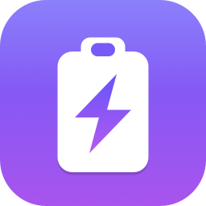

<p align="center">
  
</p>

<h1 align="center">Swift Paste</h1>

<p align="center">
  A macOS clipboard history in the menu bar. Tap <b>⌥ Option twice</b> and it opens at your
  cursor — like <code>Win+V</code> on Windows. Text, images and files.
</p>

## Install

Download the latest `SwiftPaste.zip` from [Releases](../../releases), unzip, drag
**Swift Paste.app** to Applications, and open it.

Then enable **Swift Paste** in System Settings › Privacy & Security › Accessibility. It needs
this to see the ⌥⌥ shortcut and to paste for you. Nothing else is required.

## Use

| | |
| --- | --- |
| Open at cursor | tap ⌥ twice, or click the menu bar icon |
| Search | just type |
| Paste | ↩ · or ⌘1–⌘9 · or click |
| Preview | space |
| Delete | ⌫ |
| Pin | ⌘P |
| Close | esc |

Drag any entry straight into another app — text drops as text, images and files drop as files.
Right-click the menu bar icon for settings.

## Settings

**Keep at most** *N* entries (default 300, or unlimited) and **remove entries older than**
1 hour → 1 year (default never). Pinned entries are exempt from both and survive *Clear History*.

History lives in `~/Library/Application Support/SwiftPaste/`. Passwords from password managers
are ignored.

## Build

```bash
./build.sh --install     # build and install to /Applications
```

Needs macOS 13+ and the Xcode command line tools.

Rebuilding changes the ad-hoc signature, which quietly voids the Accessibility grant even though
the toggle still looks on. Use `./build.sh --reset-perms` and grant it again.

## CI/CD

Two GitHub Actions workflows:

- **CI** (`.github/workflows/ci.yml`) — builds and verifies the app bundle on every push and PR.
- **Release** (`.github/workflows/release.yml`) — on a `v*` tag, builds the app, zips it, and
  publishes a GitHub Release with the zip attached.

```bash
git tag v1.0.0 && git push --tags
```

## Layout

| File | Role |
| --- | --- |
| `AppDelegate.swift` | Menu bar item, permissions, retention sweep |
| `DoubleTapHotKey.swift` | Double-tap ⌥ detection |
| `ClipboardMonitor.swift` | Pasteboard polling and capture |
| `ClipboardStore.swift` | History, persistence, pinning, retention |
| `PopupController.swift` | The popup panel, keys, paste |
| `PreviewController.swift` | Space-to-preview panel |
| `HistoryView.swift` | The list |
| `Settings.swift` · `SettingsView.swift` | Retention preferences |
| `Paster.swift` | Pasteboard writes and synthetic ⌘V |
| `Tools/make-icon.swift` | Draws the app icon |
