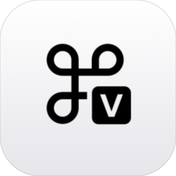
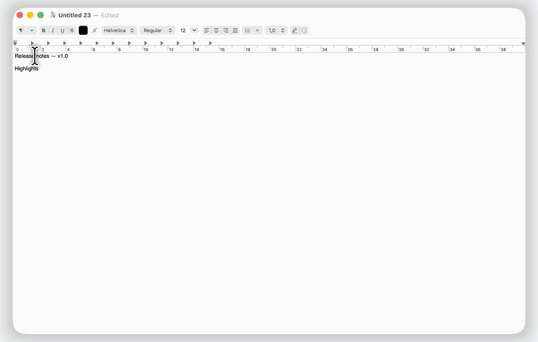
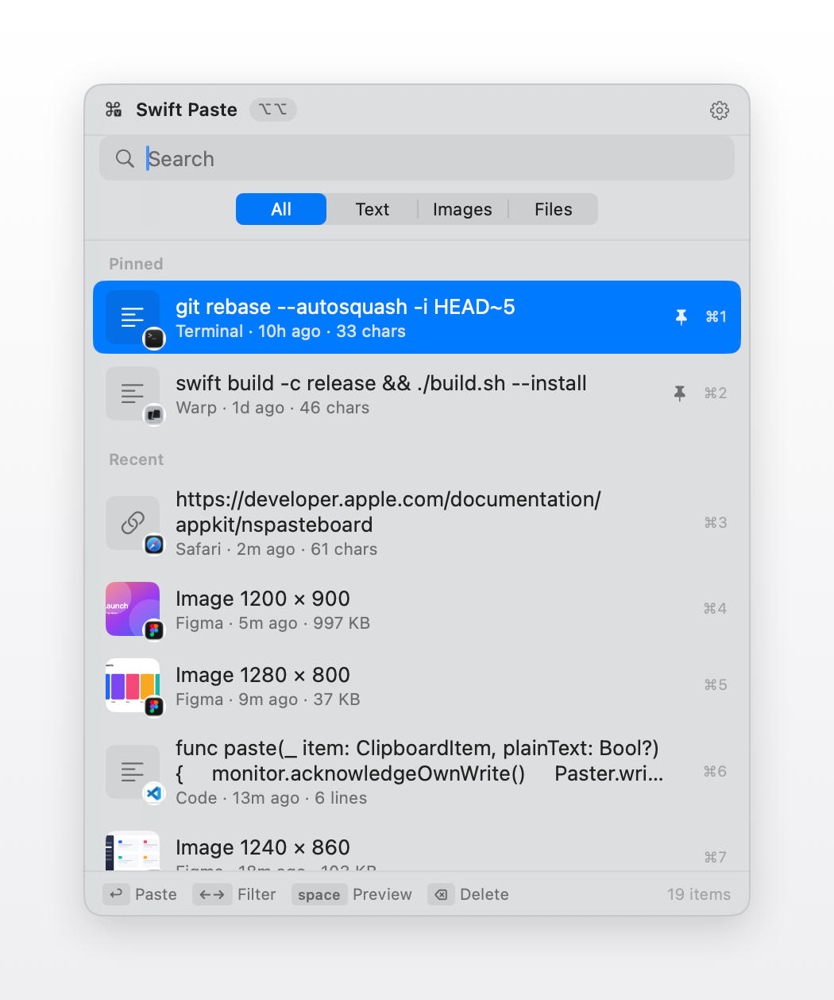
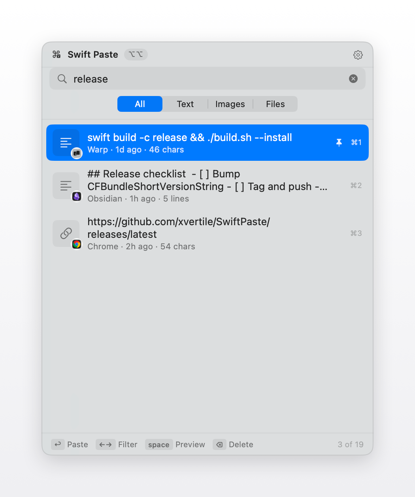
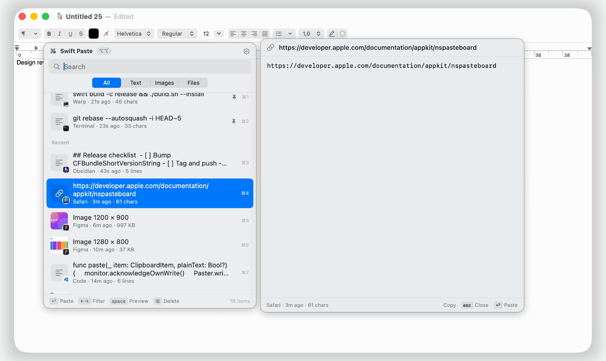
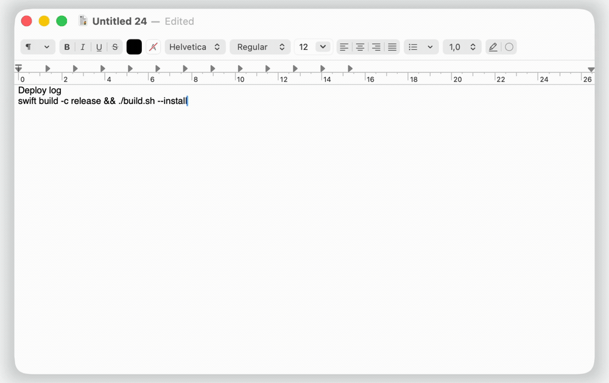
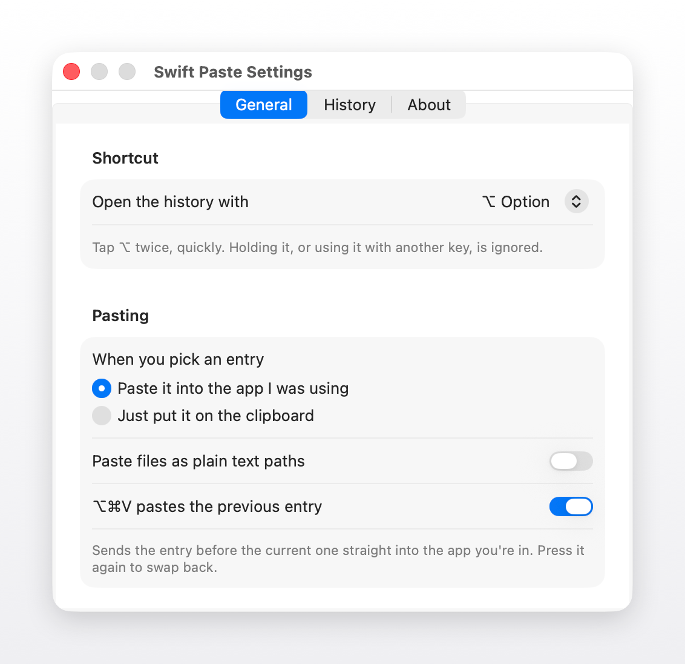

<p align="center">
  
</p>

<h1 align="center">Swift Paste</h1>

<p align="center">
  Everything you've copied, one keystroke away.
</p>

<p align="center">
  <a href="https://github.com/xvertile/SwiftPaste/releases/latest"></a>
  <a href="https://github.com/xvertile/SwiftPaste/releases"></a>
  <a href="https://github.com/xvertile/SwiftPaste/actions/workflows/ci.yml"></a>
  
  <a href="LICENSE"></a>
</p>

<p align="center">
  <a href="https://github.com/xvertile/SwiftPaste/releases/latest/download/SwiftPaste.dmg">
    
  </a>
</p>

<p align="center">
  <sub>Free · Open source · Apple silicon and Intel · <a href="https://swiftpaste.app">swiftpaste.app</a></sub>
</p>

<br>

<p align="center">
  
</p>

Swift Paste is a menu bar app that remembers what you copy — text, images and files,
in the order you copied them. Tap ⌥ Option twice and the history opens right where your
mouse is; type to search, hit return to paste. It's free, open source, and everything
stays on your Mac — no account, no sync, no network calls at all.

## Install

1. Download **SwiftPaste.dmg** from [Releases](https://github.com/xvertile/SwiftPaste/releases/latest).
2. Open it and drag **Swift Paste** into Applications.
3. Launch it — it lives in the menu bar from then on.
4. Grant Accessibility access when prompted (System Settings › Privacy & Security ›
   Accessibility). Swift Paste needs this to detect the double ⌥ tap and to paste into
   whatever app you're using.

## What it does

<table>
<tr>
<td width="50%" valign="top">

<br><b>Opens where you are</b><br>
<sub>Tap ⌥ Option twice and the history opens at your mouse cursor, not the corner of the
screen. Your text caret never moves.</sub>
</td>
<td width="50%" valign="top">

<br><b>Type to search</b><br>
<sub>No search bar to click into. Start typing and the list filters as you go.</sub>
</td>
</tr>
<tr>
<td width="50%" valign="top">

<br><b>Finder-style preview</b><br>
<sub>Hit space to preview any entry, then select just the part you need and copy it out.</sub>
</td>
<td width="50%" valign="top">

<br><b>⌥⌘V, no popup</b><br>
<sub>Pastes the entry before the current one straight into your app. Press it again to
swap back to the last one.</sub>
</td>
</tr>
</table>

- **Filter by type** — narrow to text, images or files with ← / → or the All · Text · Images · Files control.
- **Pin what matters** — ⌘P pins an entry. Pinned items never expire, and they survive *Clear History*.
- **Drag it out** — drag any row into another app; text drops as text, images and files drop as files.
- **Stays on your Mac** — no account, no sync, no telemetry, and no network calls. Everything lives in a folder on disk.

## Shortcuts

| | |
| --- | --- |
| Open at cursor | tap ⌥ twice, or click the menu bar icon |
| Search | just type |
| Filter by type | ← / → , tab / ⇧tab, or the All · Text · Images · Files control |
| Paste | ↩ · or ⌘1–⌘9 · or click |
| Paste as plain text | ⌥↩ |
| Paste the previous entry | ⌥⌘V — anywhere, without opening the list |
| Copy without pasting | ⌘C |
| Preview | space |
| Pin | ⌘P |
| Delete | ⌫ |
| Settings | ⌘, |
| Close | esc |

**⌥⌘V** pastes the entry *before* the current one straight into whatever app you're in,
without opening anything — press it again to swap back. Turn it off in Settings if another
app wants that chord.

In a preview you can select text with the mouse and ⌘C it, or hit the **Copy** button.
Right-click the menu bar icon for settings.

## Settings

<p align="center">
  
</p>

Open with **⌘,**, the gear in the popup, or the menu bar icon.

**General** — which modifier opens the history (⌥, ⌘, ⌃, ⇧, or off), whether picking an entry
pastes it into the app you were using or only copies it, pasting files as plain paths, showing
the source app on each row, and opening at login.

**History** — keep at most *N* entries (default 300, or unlimited), remove entries older than
1 hour → 1 year (default never), and whether images are captured at all. Pinned entries are
exempt from every rule and survive *Clear History*.

**About** — version, the full shortcut list, and a link to this repo.

## Privacy

History lives in `~/Library/Application Support/SwiftPaste/` and never leaves the machine.
There is no account, no sync and no telemetry. Content that password managers mark as
confidential is ignored and never recorded.

Releases are built by GitHub Actions from the tagged source, and each one links the run that
produced it, so you can check the binary came from the code in this repo.

<details>
<summary><b>Building from source</b></summary>

<br>

```bash
./build.sh --install     # build and install to /Applications
```

Needs macOS 13+ and the Xcode command line tools.

Rebuilding changes the ad-hoc signature, which quietly voids the Accessibility grant even
though the toggle still looks on. Use `./build.sh --reset-perms` and grant it again.

| File | Role |
| --- | --- |
| `AppDelegate.swift` | Menu bar item, permissions, retention sweep |
| `DoubleTapHotKey.swift` | Double-tap ⌥ detection |
| `GlobalHotKey.swift` | The ⌥⌘V registration |
| `ClipboardMonitor.swift` | Pasteboard polling and capture |
| `ClipboardStore.swift` | History, persistence, pinning, retention |
| `PopupController.swift` | The popup panel, keys, paste |
| `PreviewController.swift` | Space-to-preview panel |
| `HistoryView.swift` | The list |
| `Settings.swift` · `SettingsView.swift` | Preferences |
| `Paster.swift` | Pasteboard writes and synthetic ⌘V |

</details>

<details>
<summary><b>Media and release tooling</b></summary>

<br>

| Command | What it does |
| --- | --- |
| `swift Tools/make-brand.swift` | Renders every brand asset from `Resources/logo.svg` |
| `Tools/demo.sh on` \| `off` | Swaps in a demo history for capture, and puts yours back |
| `Tools/screenshots.sh` | Drives the app and captures the framed screenshots |
| `Tools/record.sh` | Records the demo clips with Cap and exports MP4 + GIF |
| `Tools/make-dmg.sh` | Packages `build/Swift Paste.app` as a DMG |

`Tools/demo.sh on` copies your real history to
`~/Library/Application Support/SwiftPaste.real-history` before replacing it. `off` moves it back.

</details>

## Releasing

```bash
git tag v1.0.0 && git push --tags
```

The Release workflow builds the app, stamps the version from the tag, and publishes the DMG,
the zip and a `checksums.txt`. It can also be run from the Actions tab without pushing a tag.

## License

MIT — see [LICENSE](LICENSE).
